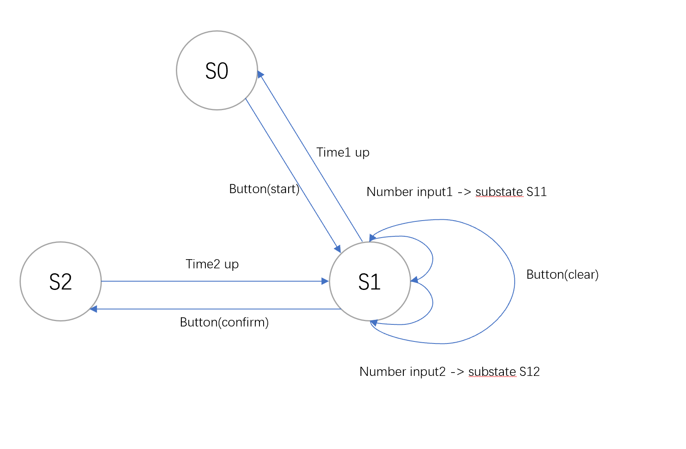

# EDA2 Report
力9 魏冰川 2019011616 weibc19@mails.tsinghua.edu.cn

# Module Design and Debugging
## Keypad 
Use state machine to control the keypad input: d0 for waiting for input, d1 for scanning, d2 for decoding. If a button is pressed,   `anti_shaking` will be enabled to take down the lasting time of this press. If this register overflow, we think it an effective action. 

Instead of writing a testbench for keypad module, I wrote a synthesisable keypad test which connect the keypad output to a counter and give it to a 7-segment LED. By observing the behavior the LED tube, we can check whether my code is effective.
## LED display
For LED display, I use 250 Hz clock to scan AN0 to AN3 and use AN0 to AN3 as input of a demux with input from 4 BCD code source. To test this module, I wrote a test with 7 segment LED tube input from 16 switch button.
## Monostable Circuit
This module is aimed for auto reset to S0, when state comes to S1, the monostable circuit is triggered, after 10s, the monostable with generate a negative edge to reset the state machine to S0, if state S1 if refreshed, the timer for monostable circuit will be reloaded.

## State machine Design
### State Define
Code as follows:
```verilog
 /*****************
 ** Define state ** 
 ******************/
  //S0 for inital state displaying nothing, S1 for input with two substate, S2 for counter
reg [1:0] current_state;
assign current_state_wire = current_state;
reg [1:0] substate; // substates in S1(input mode)
parameter S0 = 2'b00, S1 = 2'b01, S2 = 2'b10;    //S0 for inital mode, S1 for input mode, S2 for counting mode
parameter S10 = 2'b00, S11 = 2'b01, S12 = 2'b10; //S10 for waiting input, S11 for first number input, S12 for two numbers input
```
State transition diagram as below:



### Transition design
There are two ways to induce the change of state: button and timer. Use if statement to combine these two ways.
## Time calculator
This module is used to calculate the charging time based on the input number. The aim is achieved mainly by BCD-binary conversion, more details will be talked in detail part. If input is larger than 20, the input will be limited to 20 and time for 40. This module uses 100MHz clock to count for 1 second to change the time display.
## Buzzer
Buzzer is used to play music. I define a 30-bit register and use its 6 MSB as a frequency divider: 
```verilog
reg [29:0] tone;
always @(posedge CLK) tone <= tone+1;
wire [5:0] fullnote = tone[29:24];
```
This will generate 64 kinds of frequency, I organize these 64 frequencies as Equal Temperaments by divide the frequency by 12, which is implemented in its submodule divide-by-12. The quotient will represent the octave and the remain will represent the note in this octave. Since the frequency of note is not a clean integer, I made a look-up table to check the note.
```verilog
always @(note) begin
    case(note)
        0: clkdivider = 512-1; // A
        1: clkdivider = 483-1; // A#/Bb
        2: clkdivider = 456-1; // B
        3: clkdivider = 431-1; // C
        4: clkdivider = 406-1; // C#/Db
        5: clkdivider = 384-1; // D
        6: clkdivider = 362-1; // D#/Eb
        7: clkdivider = 342-1; // E
        8: clkdivider = 323-1; // F
        9: clkdivider = 304-1; // F#/Gb
        10: clkdivider = 287-1; // G
        11: clkdivider = 271-1; // G#/Ab
        default : clkdivider = 0;
    endcase
end
```
Octave is easy to implement with a shift. Output changes if and only if both octave and note is up:
```verilog
reg [8:0] counter_note;
always @(posedge CLK) begin
    if(counter_note==0) counter_note <= clkdivider; 
    else counter_note <= counter_note-1;
end

reg [7:0] counter_octave;
always @(posedge CLK) begin
    if(counter_note==0) begin
        if(counter_octave==0)
            counter_octave <= (octave==0?255:octave==1?127:octave==2?63:octave==3?31:octave==4?15:7);
        else
            counter_octave <= counter_octave-1;
    end
end


reg speaker;
always @(posedge CLK) if(counter_note==0 && counter_octave==0) speaker <= ~speaker;
``` 
Then octave and note are changed continuously, this will make a Chromatic Scale.

# Details
## BCD-binary conversion
BCD is easily changed to binary using multiplication and adding. Since verilog and tackle with multiplication by directly using `*` operator, no special method is needed.

Binary to BCD uses a special algorithm `double dabble`, the algorithm is :
1. Left-shift the binary 1 bit at a time 
2. Every time after shifting, examine every BCD digit , if it is larger than 5, add 3 and go on
Code as below :
```verilog
module bin2bcd(
   input [13:0] bin,
   output reg [15:0] bcd
   );
   
integer i;
	
always @(bin) begin
    bcd=0;		 	
    for (i=0;i<14;i=i+1) begin					//Iterate once for each bit in input number
        if (bcd[3:0] >= 5) bcd[3:0] = bcd[3:0] + 3;		//If any BCD digit is >= 5, add three
	if (bcd[7:4] >= 5) bcd[7:4] = bcd[7:4] + 3;
	if (bcd[11:8] >= 5) bcd[11:8] = bcd[11:8] + 3;
	if (bcd[15:12] >= 5) bcd[15:12] = bcd[15:12] + 3;
	bcd = {bcd[14:0],bin[13-i]};				//Shift one bit, and shift in proper bit from input 
    end
end
endmodule
```
## Some verilog syntax problem
### wire and reg with the same name
We always need a module input driven by a register, however, instantiation only allows for wire input. So we need to declare two variables :
```verilog
wire foo;
reg foo_reg;
assign foo = foo_reg;
moduleA A(foo);
```
This will cause redundancy in our code, so I want to check whether there is a way to do this more gracefully. In one post I found that if you declare a wire and reg variable with the same name, they will be connected automatically like below :
```verilog
wire foo;
reg foo;
moduleA A(foo);
```
At first I suppose this to be a good way so I adopt this method and no problem is encountered. However, after several trial the warning came, and then errors. Finally I found this syntax is not stable and may sometimes cause the complier to complain, so it is better to use the first way.
### Array port
In many verilog tutorials I see array:
```verilog
input [3:0] bcd [3:0];
```
I use this in my code and found it can not be synthesised, actually this is a system verilog grammar. There is a point that not every verilog commands can be synthesised.
## Some typical Bugs 
Some typical bugs is encounter in this project:
### Reg not initialized
Reg can be initialized both in testbench or in design sources and this is very useful feature. Initialization of reg in design sources is done every time the FPGA is reset. 
### Multiple Driven
There is a critical warning when synthesis: `Multiple Driven`, this is actually what we call `line and` in theoretical class. This should be carefully checked when a reg is change by multiple ways. (For example our state machine)
### Inferring Latch
This is the most  subtle part of this project. When write a code like this :
```verilog
always @(A) begin
case A
    2'b01: do something
    2'b11 : do something
endcase
end
```
This kind of code will be synthesised as a combinatorial circuit. However, since the possible values are not exhausted, this circuit be be considered as a latch. Since latch is not expected in FPGA, the warning of "inferring latch" will emerge. However, this warning will not block the implementation, so I finally got a circuit whose behavior is not defined properly.

About latch on FPGA, I referenced :
https://www.nandland.com/articles/what-is-a-latch-fpga.html

https://www.nandland.com/articles/how-to-avoid-transparent-latches-in-vhdl-and-verlog.html

## Edge triggering
Since asynchronous circuit design is not good for us, I need to use edge triggering for my circuit. I use this method to catch the edge of a signal:
```verilog
reg flag;
reg signal;
always @(posedge CLK) begin
    flag <= signal;
end
wire posedge_signal = (signal) & (~flag);
wire negedge_signal = (~signal) & (flag);
```
This method is very useful 
## Data transfer of multiple time domain
From the beginning of the project, I used to write a clock divider for each individual module. However, I found it not a good way to do this. Since every module will have a $t_{pd}$, if we use divided clock to drive the circuit of next level. Then the signal generated by the next level circuit will be synchronous no more. So special methods must be taken to ensure the data transfer of the data from different clock domain. This is called CDC(Clock Domain Crossing)

[A reference on CDC](https://www.verilogpro.com/clock-domain-crossing-part-1/)

# Summary
This time I learned how to design a sequential circuit using verilog, and learned how to solve the encountered problems. The most important part is : always think the physical implementation of the verilog in real circuit, especially for the flip-flops and lathes. To tell the difference of sequential and combinational circuit is important. In sequential circuit, scenarios in `always` block needn't be exhausted, but combinationals need. Also, distinguishing between current state and the next state is important. This will help us construct the right sequential.

State machine is very useful in sequential design, like keypad, LED, etc. can all be controlled using state machine. State machine is a powerful way to understand the behavior of the sequential circuit.

